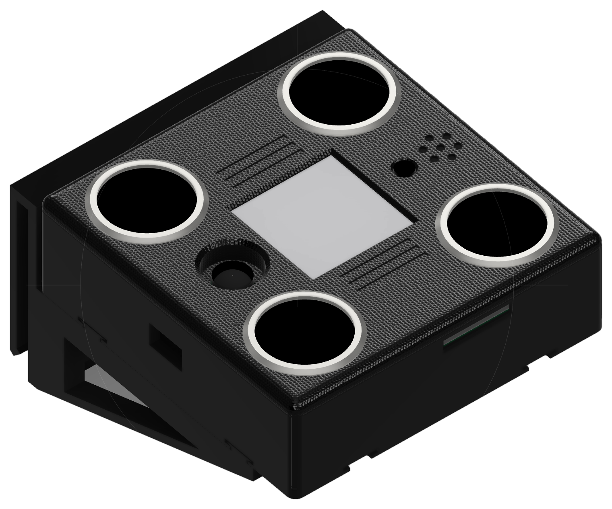
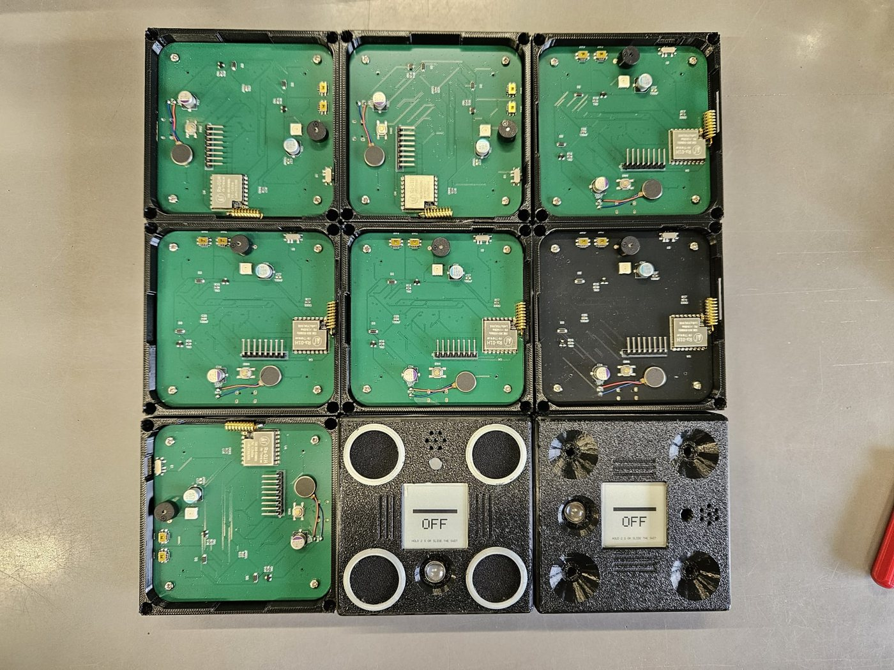
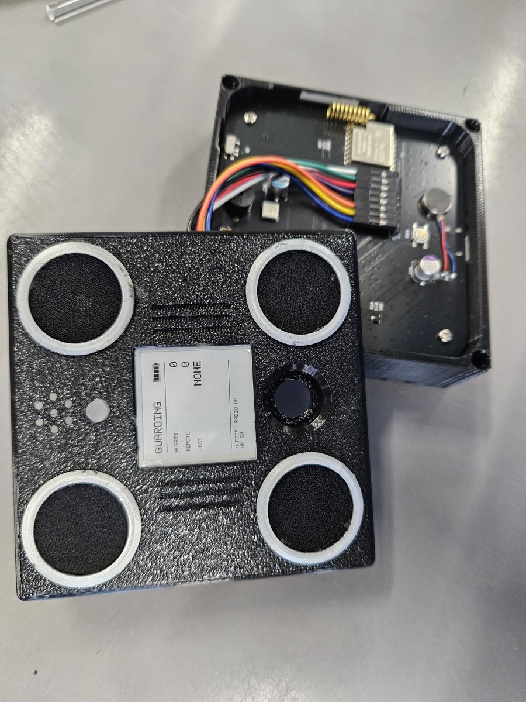
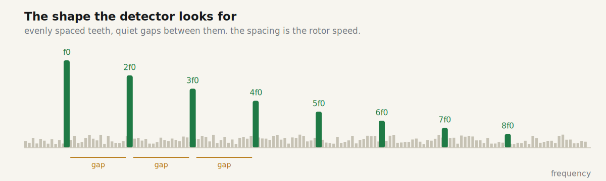

<picture>
  <source media="(prefers-color-scheme: dark)" srcset="docs/images/logo-dark.svg">
  
</picture>

### Open-source acoustic drone detection. It hears the propellers, not the radio.

 

**[Website](https://volantitech.com)** · **[Live simulator](https://volantitech.com/#simulator)** · **[Build it on a breadboard](docs/breadboard-build.md)** · **[Build the full unit](docs/pcb-build.md)** · **[Photos and videos](docs/gallery.md)**

Detection and alert only. No jamming, no interception, no countermeasures, ever.

---

A 91 mm box with four microphones, an ESP32-S3, an e-paper screen and a LoRa radio. It listens for the harmonic comb a multirotor makes and when it hears one it beeps, flashes red, buzzes, writes the time to a screen that survives a power cut, and tells every other unit on the network.

If you want the short illustrated version, or to watch the detector work on a sound field you control, that is what [the website](https://volantitech.com) and [the simulator](https://volantitech.com/#simulator) are for. This page is the long version, and everything needed to build one is in this repository.

<table>
<tr>
<td align="center" width="20%"><h3>104 m</h3>measured detection, hovering airframe, light wind</td>
<td align="center" width="20%"><h3>0.23 s</h3>from first sound to alarm</td>
<td align="center" width="20%"><h3>none</h3>false alarms in field sessions so far</td>
<td align="center" width="20%"><h3>18 to 22 h</h3>on one battery charge</td>
<td align="center" width="20%"><h3>£50 to £80</h3>parts for a full unit</td>
</tr>
</table>

## Contents

**Understand it**: [The problem](#the-problem) · [What the device does](#what-the-device-does) · [How it works](#how-it-works) · [Radio](#radio) · [Power](#power) · [Range and testing](#range-and-testing)

**Build it**: [Two ways to build it](#two-ways-to-build-it) · [Breadboard guide](docs/breadboard-build.md) · [Full unit guide](docs/pcb-build.md) · [Flashing](docs/flashing.md) · [Running several units](#running-several-units)

**Everything else**: [Photos and videos](docs/gallery.md) · [Test results](docs/test-results.md) · [Deploying](docs/deploying.md) · [Contributing](#contributing) · [Scope](#scope) · [Licence](#licence)

**Files**: [firmware](firmware/) · [PCB, BOM and placement](hardware/pcb/) · [printable enclosure](hardware/enclosure/) · [test audio](test/) · [website source](index.html)

---

## The problem

Nearly all drone detection listens for radio. It finds the control link between the pilot and the aircraft, decodes it, and reports where both are. It works well, and it has one hard failure: the drone has to transmit.

A fibre-optic FPV drone does not. It trails a thread of glass back to its operator, video comes down the fibre, control goes up it, and the radio spectrum stays silent. There is nothing to find and nothing to decode.

What it cannot hide is four motors spinning propellers. A 7 in three-blade propeller on a 2807-class motor puts a precisely structured comb of harmonics into the air, spaced by the blade-passage rate, and that spacing is set by physics the airframe cannot switch off. VolAnti listens for that structure.

It is not radar and not a replacement for one. It is a cheap local tripwire for the last few hundred metres that keeps working when the radio picture is empty, and that a school or a farm can build and repair themselves.

## What the device does

It runs continuously and does one job. Every 32 ms it takes a new slice of sound from the four microphones, folds them together, measures how comb-like the spectrum is, and asks four independent detectors whether that is a rotor.

When one of them says yes, five things happen at once.

| Channel | What happens |
|---|---|
| Beeper | Loud and patterned. The one that carries through a wall. |
| LED | Solid red through the light pipe in the lid. |
| Motor | A haptic pulse for whoever is holding it. |
| E-paper | The alert and the time, and it stays on the screen with no power. |
| LoRa | An 18 byte packet to every other unit in range. |

Between alerts the light blinks slow green, so a quiet unit and a dead unit never look the same. A press on the snooze button silences the outputs for ten seconds while detection carries on underneath.

 

## How it works

A propeller with B blades turning at R revolutions per second chops the air B×R times a second. That is the fundamental. Because the chopping is not a smooth sine, energy also lands at 2×, 3×, 4× and so on, and the result is a harmonic comb: peaks at even spacing with quiet gaps between.

Wind, traffic and rain smear across the whole spectrum. Evenly spaced teeth do not, and their spacing is the rotor speed. So the detector measures a rate and checks that it holds still.

**Four microphones to one number.** Four ICS-43434 MEMS microphones sit in a plus, 79 mm corner to corner, clocked from one source. Their four streams are added. At these frequencies 79 mm is a tenth of a wavelength, so sound from any direction adds in phase and each capsule's own noise does not. That is about 6 dB of signal to noise for free and it is nearly omnidirectional. Beamforming was tried at this size and buys nothing, so the array is a sensitivity device, not a direction finder.

**Spectrum.** A 2048 point FFT every 512 samples at 16 kHz, one frame every 32 ms.

**Adaptive floor.** The detector keeps a running picture of what the site normally sounds like at every frequency and subtracts it. Quiet things are learned in about 6 s, loud broadband bursts in under a second, which is what stops a passing lorry parking itself in the noise model.

**Comb score.** For every candidate rate from 70 to 2000 Hz, add the energy on that comb's teeth, subtract the energy in its gaps, normalise, keep the best.

**Track and hold.** One high scoring frame means nothing. The same rate has to win six frames in a row within 2 %. Noise does not do that. A rotor does.

**Four detectors on one spectrum.** A single detector would have to be tuned for either a drone that arrives or a drone that hovers, so there are four, and the alert is whichever is sure first.

| | Tier | Catches | How | Latency |
|---|---|---|---|---|
| 1 | Fast comb | An aircraft that arrives, approaches or changes | Comb score against the fast floor | 0.23 s |
| 2 | Slow comb | An aircraft that arrives and then hovers | Same score against a 30 s floor | 1.4 to 4 s |
| 3 | Envelope wash | Loaded, close, high thrust flight | Broadband modulation above 3 kHz | 1 to 3 s |
| 4 | No-floor comb | A long hover somewhere that never goes quiet | 2 s Welch spectrum, whitened, no floor | 5 to 15 s |

Tier 1 is sealed: golden test vectors pin its behaviour, and the same audio gives the same score to the last decimal place on a laptop and on the board. Tier 4 is the one that fired at 104 m.

More detail, including the numbers behind each stage, is in [docs/how-it-works.md](docs/how-it-works.md). All of it runs live in [the simulator](https://volantitech.com/#simulator).

## Radio

Each unit carries an Ra-01H LoRa module and a spring antenna lying in the wall of the case. The alert packet is 18 bytes: identity, tier, rate, score, sequence. There is no relay and no mesh. Every unit hears every other unit directly, which is a thing you can test in an afternoon.

The link spreads an alert, it does not vote on one. Every unit decides for itself. Waiting for a second opinion costs seconds and seconds are the whole product.

The frequency has to be set for the country of use: 868 MHz in the UK and EU, 915 MHz in the US, and whatever the local allocation is elsewhere. Details in [docs/deploying.md](docs/deploying.md).

## Power

USB-C in, a BQ24074 charger with power path, a TPS63020 buck-boost holding 3.3 V, and a 1S 2500 mAh LiPo. About 18 to 22 hours on the cell alone.

The cell stays fitted even on a unit that lives on mains. During bring-up the board browned out when the beeper, the motor and the radio fired at the same moment on USB alone. The cell absorbs that spike. A mains unit with no battery is a unit that reboots at the exact moment it matters.

## Range and testing

**6 September 2026, 104 m.** One unit on a brick-walled street with traffic passing, the test rig hovering at the far end. Tier 4 fired at 104.2 m, 114 yards on the map, with people talking near the unit. Nothing fired on the cars. The rig is four 2807-class motors with 7 in three-blade propellers on the same frame as the airframes this was built against, each motor on its own throttle, so it holds a hover wherever the tape says. Video, the map and the test screen are in [test results](docs/test-results.md) and [the gallery](docs/gallery.md).

Since that test the detector has been tuned further, for a lower false-alarm rate and a faster reaction, and those changes are in the current firmware.

**Before it.** 21 August, open ground, changing wind: 14 m with loaded propellers, no false alarms all day. 28 August, first production board: detector output bit-identical to the reference on the golden vectors, worst frame 29.4 ms against the 32 ms budget over 1,938 frames, no overruns.

Range moves by an order of magnitude with wind. Still air and a quiet site should give 100 to 200 m. A breezy or noisy site can give 15 to 50 m. Above 8 m/s assume it is degraded. [docs/deploying.md](docs/deploying.md) has the table.

 

## Two ways to build it

<table>
<tr>
<td width="50%" valign="top">

**On a breadboard.** A dev board and four microphone breakouts. No custom PCB, nothing to solder beyond header pins. Same firmware, same detector, and it will detect a drone. About £35 to £45 and an evening.

**[Breadboard build guide →](docs/breadboard-build.md)**

</td>
<td width="50%" valign="top">

**Or the full unit.** Order the four-layer board assembled, print four parts, solder the few joints the fab cannot, screw it together. This is the unit every number on this page came from. About £50 to £80 and a weekend.

**[Full unit build guide →](docs/pcb-build.md)**

</td>
</tr>
</table>

## Running several units

A single unit is complete on its own. Several units cover more ground and move the alarm to where the people are: a unit at the fence hears the aircraft, a unit in the kitchen repeats it.

Every unit runs the full detector and alerts on its own evidence. Listening units go out on the approach sides, spaced so their coverage touches, on solar or battery. Indoor units sit where people are, on mains, and mostly repeat. One assembled and flashed spare on a shelf turns a week's repair into a two minute swap.

Face up, parallel to the ground, in shade, 2 to 4 m high, a few metres clear of steady noise. Do not publish where your units are. Siting, mains wiring, the service schedule and the planning arithmetic are in [docs/deploying.md](docs/deploying.md).

## Contributing

Build reports are the most useful thing you can send, including the ones where it did not work. Open an issue titled `Build report: <rough location, month>` with the build type, firmware version, what made the sound, the distance it was and was not detected at, the wind, and any false alarms. No maps of where your units are.

Pull requests are welcome for anything inside the scope below. Changes to the detection chain need to pass the golden vector tests unchanged, or come with new vectors and a reason.

## Scope

VolAnti detects and alerts. It will never include jamming, spoofing, interception, targeting or any other countermeasure, in this project or in any fork carrying its name. Contributions in that direction are closed without discussion.

## Licence

Hardware under CERN-OHL-W-2.0, firmware under Apache-2.0, documentation under CC BY-SA 4.0. Full texts in [LICENSES/](LICENSES/), the short version and the disclaimer in [LICENSE.md](LICENSE.md). Not a life-safety product. It will miss aircraft.

---

Designed and tested by Agam Rossen at the University of York.

