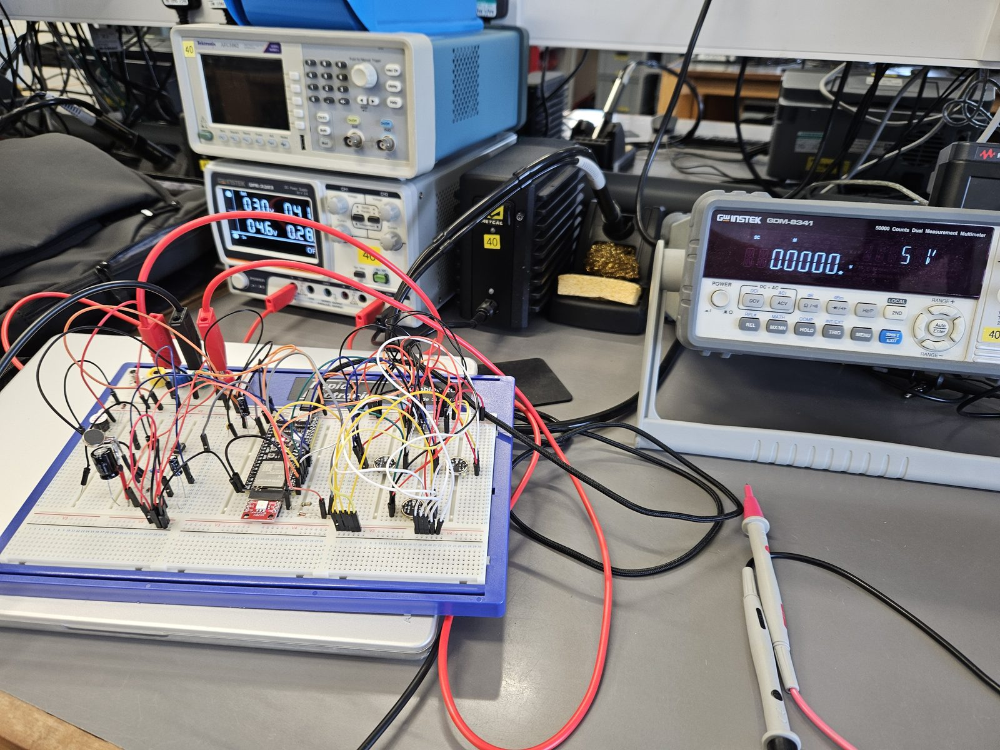
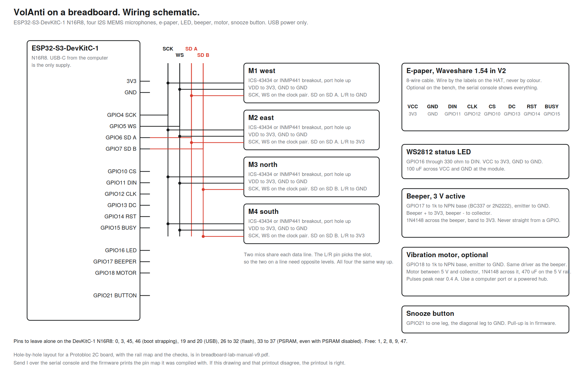

# Building it on a breadboard

The full detector on a dev board, with no custom PCB and no printed parts. This is how VolAnti was developed for its first weeks. Every algorithm in the firmware was proven on exactly this before a board was ordered, and the same image runs on both.

What you give up against the full unit: the sealed case and its wind performance, the e-paper that holds an alert with the power off, a tidy loud beeper, and a few dB of consistency from fixed microphone geometry.

## Parts

| Part | What to buy | Notes |
|---|---|---|
| Controller | ESP32-S3-DevKitC-1 **N16R8** | The memory variant matters. The firmware assumes 16 MB flash. |
| Microphones | 4 × I2S MEMS breakout, ICS-43434 or INMP441 | Any I2S breakout with SCK, WS, SD and L/R pins. |
| Display | Waveshare 1.54 in e-paper V2, black and white | Optional on the bench. The serial console shows everything. |
| LED | WS2812 breakout, 330 Ω, 100 µF | Optional. |
| Beeper | 3 V active beeper, BC337 or 2N2222, 1 kΩ, 1N4148 | Optional. Never drive a beeper straight from a GPIO pin. |
| Motor | 3 to 5 V coin vibration motor, same driver as the beeper, 470 µF | Optional. |
| Button | 6 mm tactile switch | |
| Power | USB-C data cable from your computer | The only supply. If you fit beeper, motor and radio together, expect brown-outs on USB alone. |

Plus a breadboard, male-to-male jumpers, 10 µF and 100 nF rail capacitors, and something stiff to mount the four microphones on. Skip the LoRa radio. It is a multi-unit feature and easy to add later. About £35 to £45 in total.

## Wiring

[SVG version](breadboard-schematic.svg). The hole-by-hole layout for a Protobloc 2C board, with the rail map and the checks at every stage, is [breadboard-lab-manual-v9.pdf](breadboard-lab-manual-v9.pdf).

All four microphones share one clock pair. They split across two data lines, two mics each, and the L/R pin picks which slot each one drives.

| Mic | Position | SD to | L/R to |
|---|---|---|---|
| M1 | west | GPIO6 | GND |
| M2 | east | GPIO6 | 3V3 |
| M3 | north | GPIO7 | GND |
| M4 | south | GPIO7 | 3V3 |

SCK on GPIO4 and WS on GPIO5 go to all four. Every mic: VDD to 3V3, GND to GND, same orientation, port hole up and never covered.

| GPIO | Function |
|---|---|
| 10, 11, 12, 13, 14, 15 | E-paper CS, DIN, CLK, DC, RST, BUSY. Wire by the labels on the HAT, never by wire colour. |
| 16 | WS2812 data, through 330 Ω |
| 17 | Beeper, through 1 kΩ to the transistor base |
| 18 | Motor, same driver, on the 5 V rail |
| 21 | Snooze button to GND. The pull-up is in firmware. |

Leave these alone on the DevKitC-1: 0, 3, 45 and 46 (boot strapping), 19 and 20 (USB), 26 to 32 (flash), and 33 to 37, which are bonded to the PSRAM die even when PSRAM is off and fail intermittently rather than cleanly. Free for your own additions: 1, 2, 8, 9, 47.

## Geometry

Mount the four breakouts on stiff card in a plus, about 56 mm across, ports up, M1 west, M2 east, M3 north, M4 south. Exact spacing does not matter for detection. It only matters that they stay put and all face the same way.

## Bring-up

1. Flash the `devkit` target. See [flashing.md](flashing.md).
2. Open the serial console and send `I`. The firmware prints the pin map it was compiled with. If your wiring and that printout disagree, the printout wins.
3. The boot report should show four healthy channels with quiet RMS values in the same order of magnitude, around 250 to 420 each on a bench. One silent channel is always a wiring fault.
4. Tap next to each mic and watch its channel respond. This catches swapped positions that every electrical check passes.
5. Play the clips in [test/audio](../test/audio/) from a phone at half a metre and watch the score cross 1.70 on the fast tier.

From here the unit behaves exactly like a boxed one. [Deploying](deploying.md) and [test results](test-results.md) apply unchanged.
