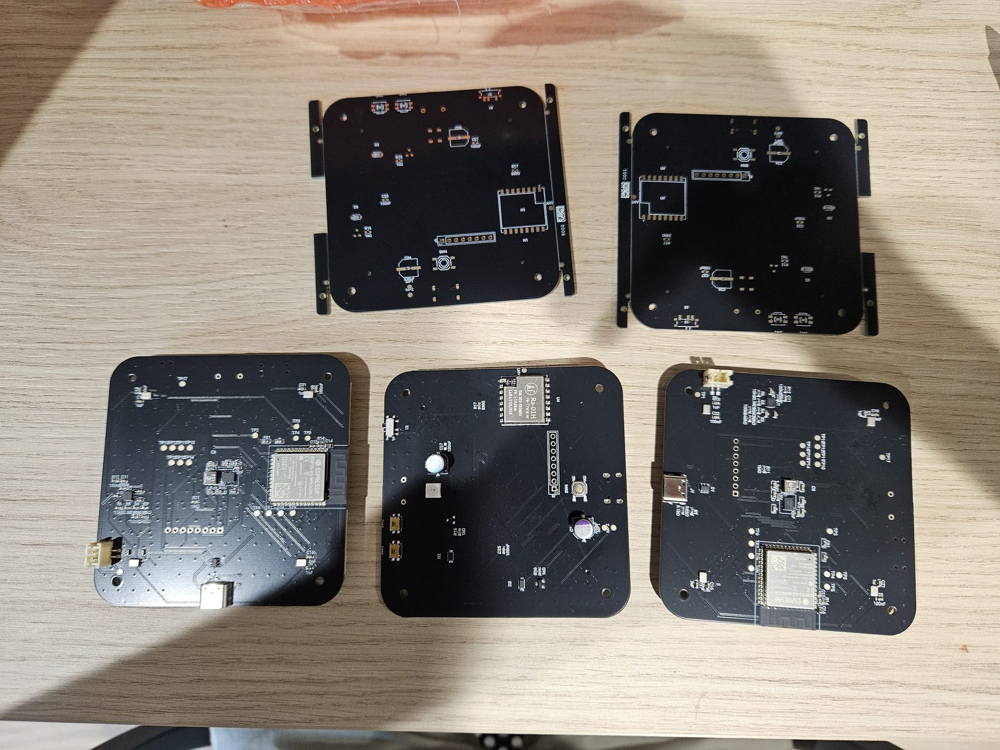
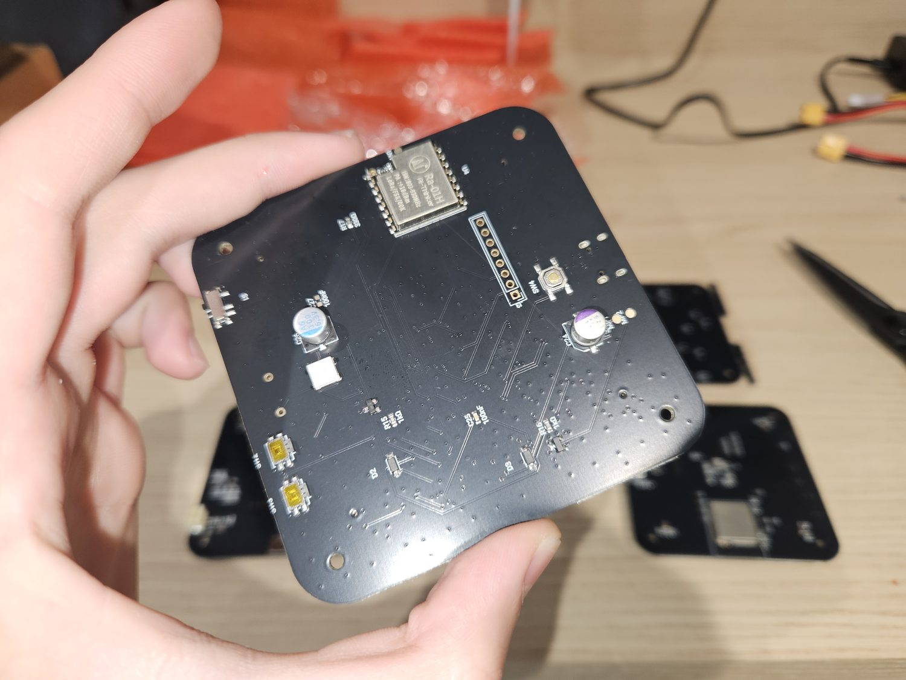
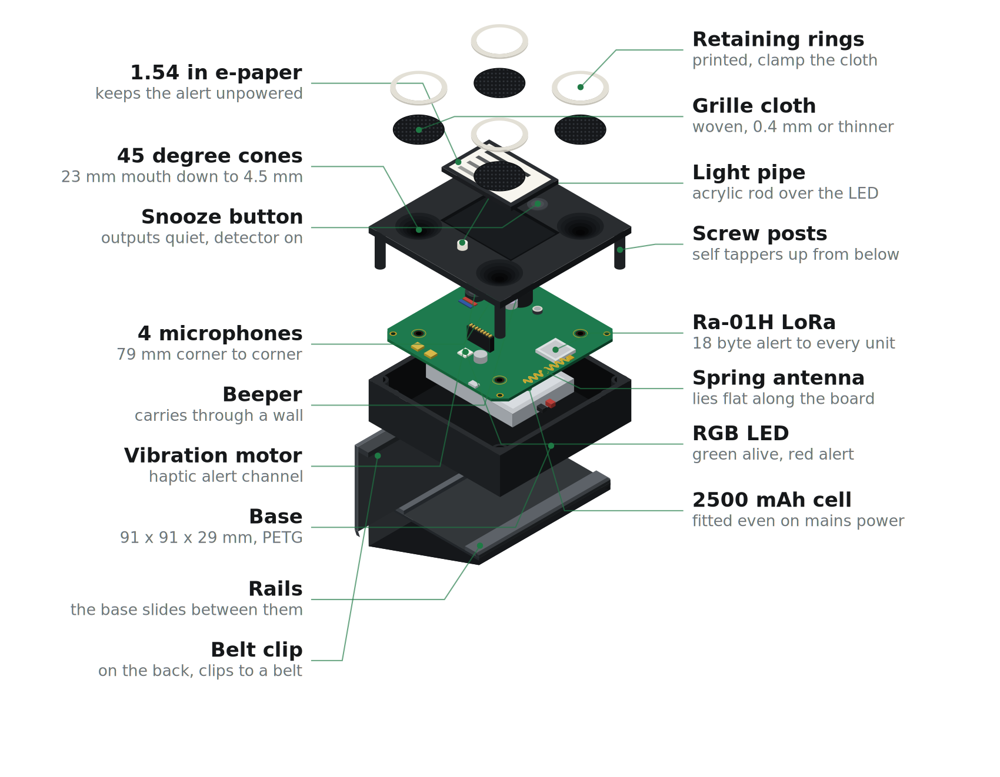
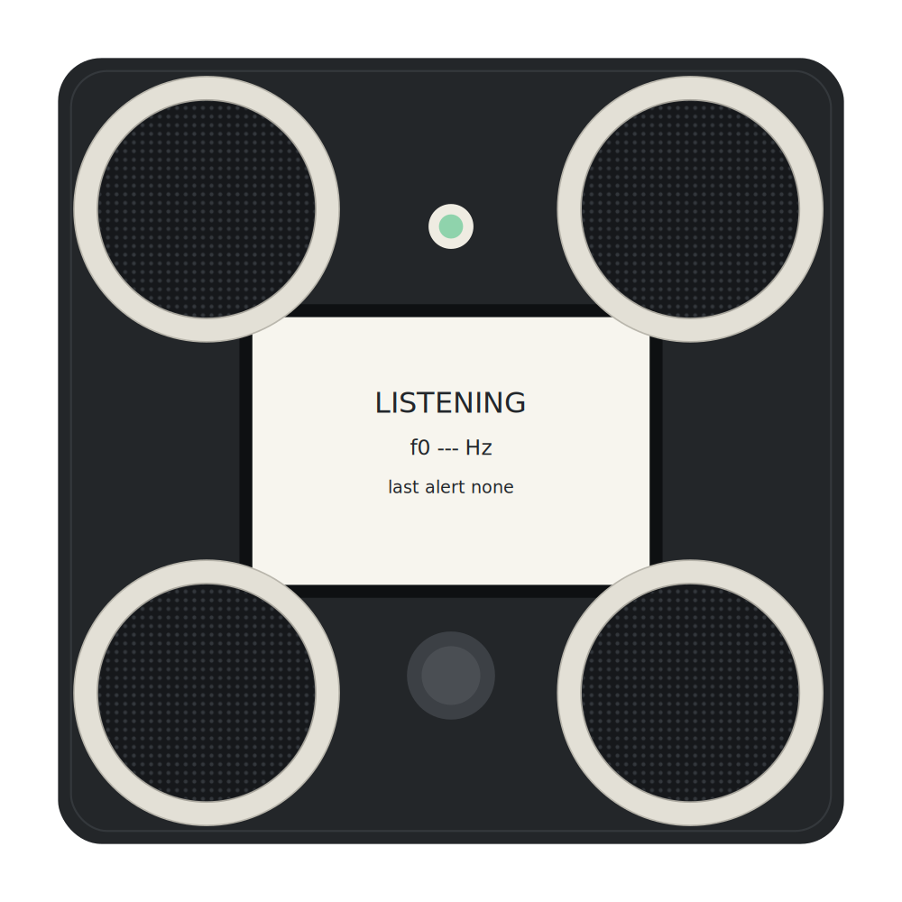
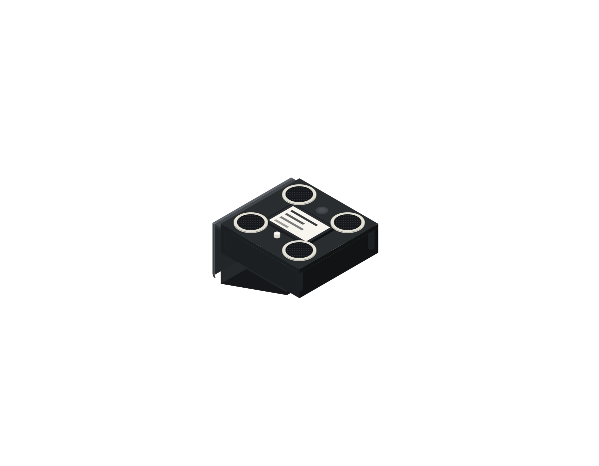

# Build photos

The pictures here are the ones that explain something: what a part looks like when it is right, what a step looks like half done, what the boards looked like when they arrived. They are meant to be useful next to the [build guide](build-guide.md).

The **full archive** is much larger and much less tidy. It is every prototype, every revision that did not work, every bench session and every failure, kept because the interesting part of a project like this is rarely the finished object.

<!-- LINK: full photo archive on Google Drive goes here -->
**Full archive:** *link to follow*

The [website](https://agamrossen.github.io/VolAnti/) carries a small selected set. This page and the archive carry the rest.

---

## The boards

Rev A2 as delivered. Bare panels at the back still in their break-off rails, assembled boards in front. The panel rails snap off by hand; the mouse-bite edges want a light file before the board goes into the enclosure.

 

**Left, the top side**, which is the side that faces the lid. The Ra-01H radio module with its spring antenna soldered flat to the pad, the eight-pin right-angle header for the screen, the snooze switch, the beeper, the vibration motor on its red and blue leads, the RGB LED and the two electrolytics. Every hand-soldered joint on the device is visible in this one photograph.

**Right, the underside**, carrying the ESP32-S3-WROOM-1 module, the USB-C receptacle, the JST battery socket, the charger and the buck-boost, and the four microphones. The microphones are bottom-port parts, so sound reaches them through acoustic holes in the board from the lid side.

84 by 84 mm, which is about a hand.

## The enclosure

Seven pieces. Grille rings, woven cloth, lid with its cone ports and screw posts, the screen, the board, the cell, the base, and the stand that also clips to a belt.

 

## Contributing photographs

Photographs of other people's builds are welcome and go a long way, especially of steps the written guide describes badly.

Two rules apply to every image in this repository and in the archive:

- **Nothing may show where a deployed unit sits relative to a real site**, and nothing may contain a map, a plan or a marked sensor position.
- Bench, lab and workshop photographs are fine, and are the most useful kind.
