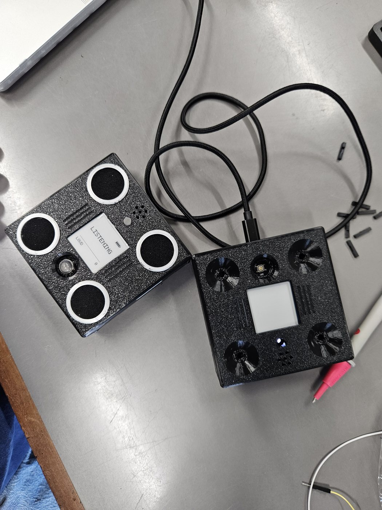
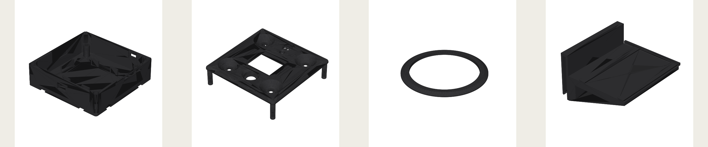

# Building the full unit

Custom four-layer board, four printed parts, a battery, a screen and a radio in a sealed 91 mm box. Two evenings once the parts arrive. The board comes from the fab with everything placed except four through-hole parts.

## What you order

| | Where | Files |
|---|---|---|
| The PCB, assembled | JLCPCB or any fab with SMT assembly | [gerbers](../hardware/pcb/gerbers/), [bill of materials](../hardware/pcb/bom.csv), [placement](../hardware/pcb/pick-and-place.csv), [ordering notes](../hardware/pcb/README.md) |
| Four printed parts | Your printer, or any print service | [STL and STEP files, print settings](../hardware/enclosure/README.md) |
| Fit parts | Anywhere | Table below |

The design itself lives in Flux: [flux.ai/agamrossen/sentry-node-v1](https://www.flux.ai/agamrossen/sentry-node-v1~wa). The schematic and every net is readable there.

## Fit parts

| Part | Spec |
|---|---|
| Battery | Protected 1S LiPo, 2500 mAh, JST-PH 2.0, no larger than 61 × 51 × 8 mm. PKCELL LP785060 or similar. |
| Battery pad | 1 mm EVA foam, cut to the bay |
| Display | Waveshare 1.54 in e-paper V2, black and white, 200 × 200. Not the three colour one, it refreshes far too slowly. |
| Antenna | Solder-type spring antenna, 868 or 915 MHz, about 17 mm coil |
| Beeper | TMB12A03 |
| Display header | 8 pin 2.54 mm right-angle male header |
| Motor, optional | Ø10 mm ERM coin motor |
| Light pipe | 5 mm clear acrylic rod, cut to 9 mm |
| Snooze dome | Ø9.5 × 3.8 mm clear hemispherical self-adhesive bumpon |
| Grille cloth | Thin woven speaker cloth, 0.4 mm or less, four Ø25 mm discs |
| Mic gaskets | 2 mm closed-cell foam rings, Ø8 mm with a Ø5 mm hole, four |
| Sealant | Neutral-cure silicone, Permatex Ultra Black 22072 or similar. Never acetic-cure near the microphones. |
| Desiccant | Two 1 g silica gel sachets |
| Screws | 4 × M2.5 × 8 mm machine screws for the board. 4 × ST2.9 × 9.5 mm stainless self-tappers for the lid. Not M3 machine screws, they split the printed pilots. |

## Hand soldering

Four joints. The fab places everything else, including the USB-C and the battery socket.

1. **Beeper, BZ1.** Top side. The pins come at 6.5 mm and the pads are 7.6 mm, so splay them gently. Polarity matters: left pad is +.
2. **Display header, J3.** Right-angle, top side, pins pointing toward the display bay. Pin order VCC, GND, DIN, CLK, CS, DC, RST, BUSY.
3. **Antenna, ANT1.** Onto the pad on the east edge, lying flat and parallel to the board so it drops into the wall channel. Do not trim the spring.
4. **Motor, MP1 and MP2.** Optional. The driver is already on the board. The motor lies flat on the top face.

## Check before it goes in the box

Power over USB-C with the battery connected. Check the plug polarity first: red must reach the VBAT pin of J2. If it is reversed, lift the two crimp tabs with a pin and swap them.

The unit boots to LISTENING in about two seconds and runs its output parade once. Then over the serial console: send `I` and confirm four healthy microphones, tap next to each port and watch the right channel respond, press the snooze button and see it register. Everything is reachable now. Nothing is once the lid is on.

## Assembly, in this order

1. Stick the snooze dome centred on the tactile switch. Press it twenty times before you go on. A mis-centred dome binds in the lid.
2. Foam gasket rings around the four microphone ports.
3. Foam pad into the battery bay, then the cell, plug into J2.
4. Board onto the four bosses, 4 × M2.5 × 8. Snug, not tight, the bosses are plastic.
5. Display into the lid tray on thin double-sided tape at the corners. Its cable plugs onto J3. The stock 200 mm cable needs coiling, or shortening and re-crimping.
6. Light pipe, 9 mm of 5 mm rod, faces polished through 400, 800 and 1200 grit, press-fit into the lid port. One wrap of PTFE tape if it is loose.
7. Grille cloth discs into the four cone recesses, bonded with a thin ring of silicone, then the grille rings on top.
8. Two silica sachets taped flat to the base floor. These go in last. At service time a saturated sachet tells you that unit's seal has failed.
9. Lid on. Corner posts and the north and south tabs, then 4 × ST2.9 × 9.5 from below.

## First power-up in the box

Hold it at arm's length. Green blink through the light pipe, LISTENING screen with four microphone marks, one clean chirp. Tap the dome and see the snooze register. Then do the only test that matters: carry a real source past it at a known distance and write down what happened. [Test results](test-results.md) has the format.
