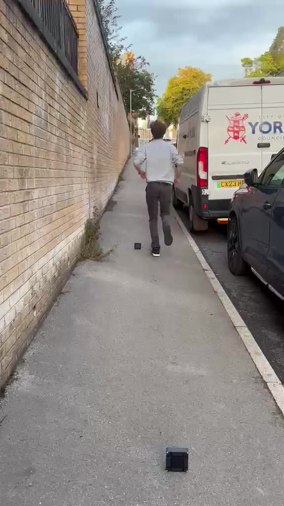
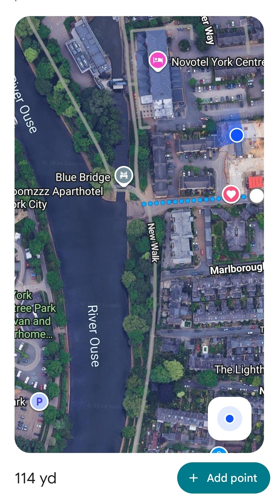
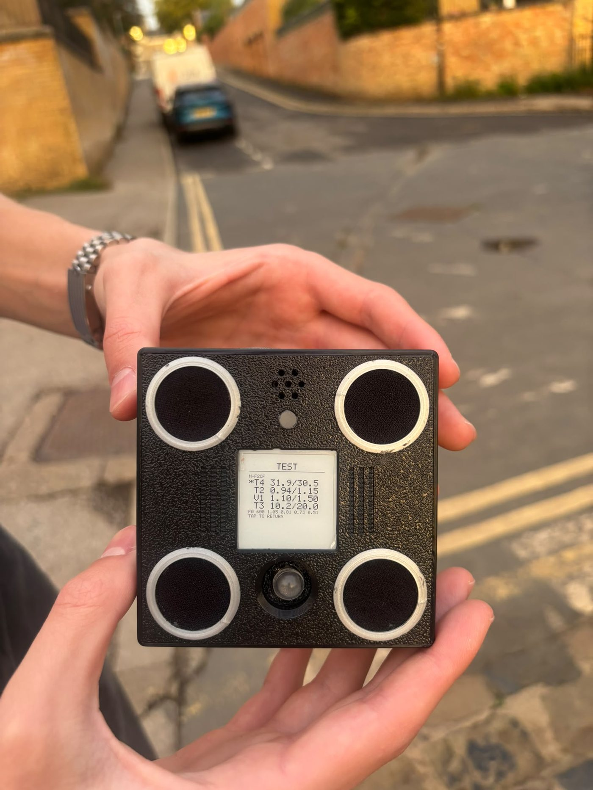
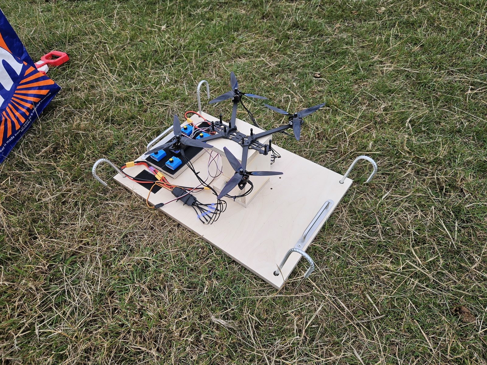

# Test results

Measured, with date and conditions, in the order it happened. Nothing here is rounded up.

## 6 September 2026: 104 m on a street

One unit, N-F2CF, held on the pavement of a brick-walled street with traffic passing and people talking nearby. The test rig hovered at the far end of the street. Distance taped and confirmed on the map: **104.2 m, 114 yards**.

| | |
|---|---|
| Tier that fired | 4, no-floor comb |
| Score | W 31.9 against a threshold of 30.5 |
| Rate | f0 600 Hz |
| Wind | light, about 1 m/s |
| False alarms | none, cars and speech included |

<table><tr>
<td width="50%"></td>
<td width="50%"></td>
</tr></table>

Videos from the session, in [the gallery](gallery.md#field-test-videos). Since this test the detector has been tuned further, for a lower false-alarm rate and a faster reaction, and those changes are in the current firmware.

## 28 August 2026: first production board

Rev A2, first bring-up. Detector output bit-identical to the reference implementation on the golden test vectors, to the last decimal place. Four tiers running together: worst frame 29.4 ms against the 32 ms budget, 1,938 frames, no overruns, over a seven minute guard. All four microphones matched within ±1 dB after per-channel calibration.

One finding shaped the build guide. With no battery fitted, beeper, motor and radio transmit at the same moment browned out a USB-only supply. The battery is part of the power design.

## 21 August 2026: open ground

Four, then two, loaded 7 in propellers on the rig, open ground, mild changing wind. Detection to about 14 m with the fast tier and the wash tier. Wind, not electronics, set the number. Close steady hovers were caught intermittently and fast throttle punches were mostly missed, both traced to the fast floor absorbing steady sounds. Tiers 2 and 4 came from this day. No false alarms across the whole session.

Loaded props measured +5.9 dB in the 125 to 1000 Hz scoring band at 4 m over site wind. The recordings from this day are in [test/audio](../test/audio/): two propellers steady, two propellers punching out, two propellers in wind at 14 m, and two wind-only captures. All 16 kHz mono WAV, straight off the array.

## 13 August 2026: bench

A single 2807-class motor with a 7 in three-blade propeller, quiet indoor conditions, through the full array. Detection at 25 to 30 m, which was the far wall of the longest room available, not the distance where it failed. First real-rotor locks at f0 = 423 and 471 Hz, inside the 375 to 475 Hz band predicted from the airframe's physics before any rotor had been heard.

## Confusers

Synthetic corpus replayed through the full pipeline: helicopter, propeller aircraft, diesel truck, motorbike, distant traffic, HVAC. No false alarms. In the lab, sustained speech close to the unit and orchestral music through a speaker have triggered the comb tiers. Both are known and both are rare in an outdoor mounting position.

## Field measurements

| Date | Build | Source | Distance | Result | Wind | Environment | Tier |
|---|---|---|---|---|---|---|---|
| 2026-08-13 | DevKit | single loaded rotor | 25 to 30 m | detected | none, indoor | lab | 1 |
| 2026-08-21 | DevKit | 4 then 2 loaded props | 14 m | detected | changing, mild | open ground | 1, 3 |
| 2026-09-06 | rev A2, N-F2CF | four-motor rig, hover | 104.2 m | detected | light, ~1 m/s | street, traffic, speech | 4 |

## Report yours

Open an issue titled `Build report: <rough location, month>` with:

    Build type:        full unit / breadboard
    Firmware version:  from the boot banner
    Mics healthy:      4/4? from the boot report
    Test source:       drone model / rig / speaker
    Distances:         detected at ___ m, not detected at ___ m
    Wind:              calm / light, leaves move / moderate, branches move / strong
    Environment:       open field / urban / indoor
    False alarms:      count over ___ hours, and the cause if known

Photos welcome. No maps of where your units are.
