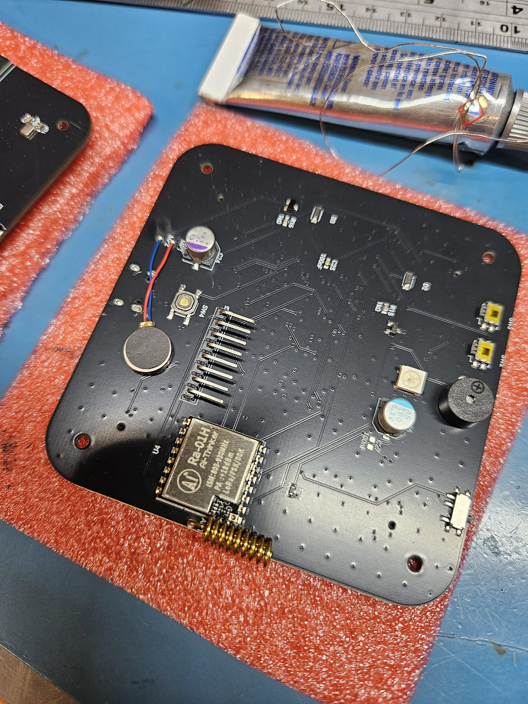
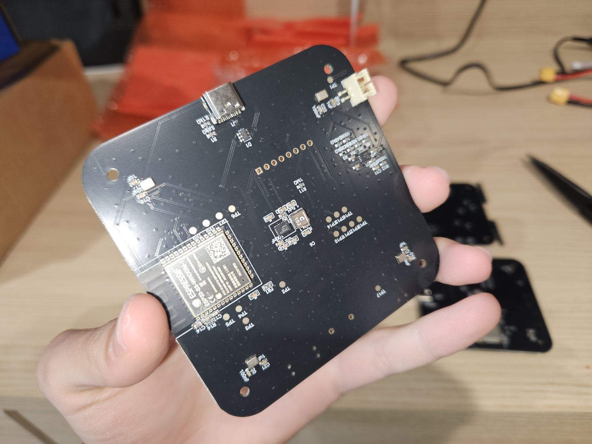

# The PCB

84 × 84 mm, four layers, ENIG, designed in Flux. One board carries the whole device: the ESP32-S3-WROOM-1-N16R8, the four microphones at ±28 mm, the LoRa radio, the charger and regulator, and every alert output. The fab assembles everything except four through-hole parts.

| File | What it is |
|---|---|
| `gerbers/VolAnti_revA2_gerbers.zip` | Gerber and drill set, rev A2, as sent to the fab |
| [bom.csv](bom.csv) | Bill of materials, 36 lines, with LCSC part numbers |
| [pick-and-place.csv](pick-and-place.csv) | Placement file for assembly |
| [placement-bottom.jpg](placement-bottom.jpg) | The fab's placement drawing for the underside |
| [Flux project](https://www.flux.ai/agamrossen/sentry-node-v1~wa) | The design itself, schematic and layout |

## Ordering from JLCPCB

1. Upload the gerber zip. Accept the detected 84 × 84 mm four-layer stackup.
2. ENIG finish, 1.6 mm, any mask colour, five is the minimum quantity.
3. Turn on assembly, top and bottom, and upload `bom.csv` and `pick-and-place.csv` when asked.
4. On the part matching screen every line carries its LCSC number. If a passive is out of stock, any same value, size and tolerance substitute is fine. Do not substitute U1 to U4, the four microphones, or the USB and battery connectors.
5. BZ1, J3, ANT1 and the motor pads are excluded from assembly on purpose. You solder those, see [the build guide](../../docs/pcb-build.md).

About two weeks door to door.

## Design notes

The microphones are bottom-ported parts firing through apertures in the board. Keep fingers and flux off the port holes. The mic positions, the shared I2S clock tree and the per-channel calibration path are exactly what the firmware assumes, which is why a stock board reproduces the golden vectors bit for bit.
