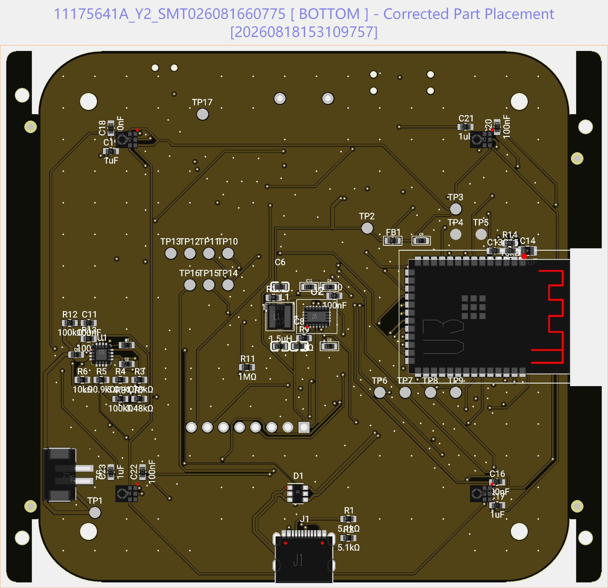

# The PCB

84 × 84 mm, 4 layers, ENIG finish, designed in Flux. One board carries the entire device: ESP32-S3-WROOM-1-N16R8, the four-microphone array at ±28 mm corners, LoRa radio, charger, regulator, and every alert output. The fab assembles everything except four through-hole parts you solder yourself.

## Files in this directory

| File | What it is |
|---|---|
| `gerbers/` | Fabrication files (Gerber + drill), rev A2 |
| [`bom.csv`](bom.csv) | Complete bill of materials, 36 lines, **with LCSC part numbers** for one-click assembly quoting |
| [`pick-and-place.csv`](pick-and-place.csv) | Component placement file for assembly |

## Ordering from JLCPCB (what we use)

1. **Upload** the zipped `gerbers/` at jlcpcb.com. Accept the detected 84 × 84 mm, 4-layer stackup.
2. Options: **ENIG surface finish** (the mic ports and RF pad deserve it), any solder-mask colour, 1.6 mm thickness, qty 5 minimum.
3. Enable **PCB Assembly**, top and bottom, and upload `bom.csv` and `pick-and-place.csv` when prompted.
4. Review the part-matching screen. Every line carries its LCSC number, so matching is automatic; if a passive is out of stock, any same-value/size/tolerance substitute is fine. **Do not substitute** U1–U4, the microphones (M1–M4), or the USB/battery connectors.
5. Note that `BZ1` (the beeper) is deliberately excluded from assembly; it and three other parts are yours to solder (build guide §1).

<!-- SHARED-PROJECT: add the JLCPCB and PCBWay shared-project links here once published, so builders can order without touching a single file. -->

Any fab with SMT assembly works; JLCPCB is simply where every board so far was made. Expect roughly 1.5–2.5 weeks door to door.

## Hand-soldered parts

Four joints: beeper BZ1, display header J3, antenna ANT1, and the optional vibration motor on MP1/MP2. Exact orientations, pitch adjustments, and polarity are in the [build guide, section 1](../../docs/build-guide.md): read it before touching the iron; two of the four have a polarity or squareness trap.

## Continuity checks worth doing on arrival

Sixty seconds with a meter before you solder anything: radio ANT pin → ANT1 pad; MP1 → 3V3 rail; MP2 → driver-transistor collector. A cold joint inside the fab's reflow is rare but cheaper to find now.

## Design notes

- The four microphone ports are bottom-ported parts firing through board apertures; keep fingers and flux off the port holes.
- The board is designed to be **geometry-honest with the firmware**: mic positions, the shared I2S clock tree, and the per-channel calibration path all assume this exact layout. That is why the firmware on a stock board reproduces the published golden vectors bit-for-bit.
- Design source lives in Flux; the schematic export is in [`../schematics/`](../schematics/).

## Placement reference

The fab's corrected placement drawing for the underside of rev A2, kept here because it is the quickest way to check a designator against the real board. The four microphones sit at the corners, the processor module and the USB-C receptacle are on this side, and the top side carries the radio, the outputs and the screen header.
